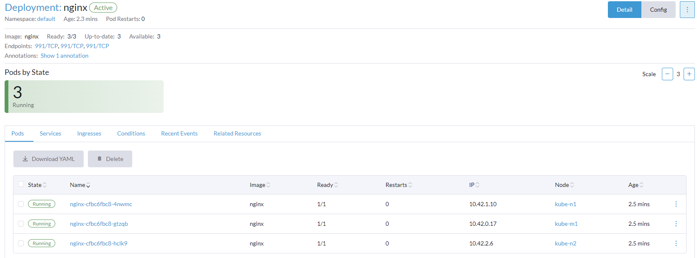

# Learning Kubernetes w/ Rancher

A project for my INFOST250 Network and System Administration class at the University of Wisconsin Milwaukee.

For this final project I am learning Kubernetes and using Rancher as my web ui for managing my containers and changing settings. More info can be found at **[rancher.com](https://rancher.com)** and **[kubernetes.io](https://kubernetes.io/)**

## About Kubernetes

Kubernetes is a container orchestration tool that allows you to manage and scale your containers. It is a very powerful tool that can be used to manage containers in a single node or in a cluster of nodes. It is used as one way to make services highly available and fault tolerant.

## About Rancher

Rancher is a web-ui tool that allows you to manage your kubernetes cluster. It is a very powerful tool that allows you to manage your kubernetes clusters from a single pane of glass. It has API's that allow it to connect to managed clusters on all the major cloud platforms as well as locally created clusters. It also has a built in catalog of applications that you can deploy to your cluster with a single click.

## Project scope

In this project I aim to set up a kubernetes cluster with 3 nodes running Ubuntu Server 22.04 and using Rancher as the web ui tool that i will use to interact with the cluster after initial setup. On the cluster I aim to have 4 services running:

## Creating the cluster

I will be installing `RKE` which is  a "certified Kubernetes distribution that runs entirely within Docker containers. It solves the common frustration of installation complexity with Kubernetes by removing most host dependencies and presenting a stable path for deployment, upgrades, and rollbacks." [Learn More about RKE](https://www.rancher.com/products/rke)  
**Do all sections in the order they appear and do not skip any steps.**

### Steps for all nodes  

1. Create and setup 3 virtual machines. Each of mine are Ubuntu Server 22.04 LTS, 32GB vHDD, 4 cores, 8GB ram. If you use a template for your virtual machines, some software that is already installed may conflict with this installation so it may help to start with a fresh install of Ubuntu Server 22.04 LTS.
2. Run updates  
**`sudo apt update && sudo apt upgrade -y`**
3. Run Stage 1 of my custom vm setup script. This one installs some basic tools, and changes some system settings.  
**`sudo su -c "bash <(wget -qO- https://antaresnetwork.com/scripts/setup-stage-1.sh)" root `**  
4. Run Stage 2 of the custom vm setup script. This one sets the hostname and installs JumpCloud then reboots the vm.  
**`sudo su -c "bash <(wget -qO- https://antaresnetwork.com/scripts/setup-stage-2.sh)" root `**  
5. Remove the installation of docker currently installed. It will cause problems with the kubernetes cluster.   
**`sudo su -c "bash <(wget -qO- https://antaresnetwork.com/scripts/deldocker.sh)" root `**  
6. Install Docker version 20.10 from the rancher repository. This is important. If you install docker from the default ubuntu repository you may have issues with the kubernetes cluster.  
**`sudo curl https://releases.rancher.com/install-docker/20.10.sh | sh`**  
You may need to run **`sudo dpkg --configure -a`** if you get an error that *Sub-process /urs/bin/dpkg returned an error code (1).* and then re-run the docker install script. It may yell at you that docker is already installed but since we installed docker with that script, it is not an issue and you can continue with the installation.
7. Congrats! You have completed the steps that are required for all nodes. Now you can move on to the master node setup.

### Master Node Setup

1. Install Rancher  
**`sudo docker run --privileged -d --restart=unless-stopped -p 80:80 -p 443:443 rancher/rancher`**  
Note: `--privileged` is required for the cluster to work properly. If you do not use this flag you may have issues with the cluster.
2. Open port 6443 in ufw if ufw is turned on.  
**`sudo ufw allow 6443`**
3. Open a web browser and navigate to the ip address of the VM on port 443. You should see the Rancher setup screen. Follow the on screen instructions to set up your admin account and password.

### Creating a cluster in Rancher

1. Click on the "Create" button at the top of the table in the middle of the screen.
2. Select the Custom option.
3. Give your cluster a name, description, select a kubernetes version (I went with 1.25.9-rancher2-1) , and uncheck "Traefik Ingress" and click "Create".
4. Wait for the cluster to finish creating. This may take a few minutes depending on your hardware.
5. Once the cluster is created, click on the "Registration" tab at the top of the table in the middle of the screen.

### Agent Node Setup

1. SSH into each node and run the command that was created when you created the cluster. It should look something like this:  
**`sudo docker run -d --privileged --restart=unless-stopped --net=host -v /etc/kubernetes:/etc/kubernetes -v /var/run:/var/run  rancher/rancher-agent:v2.7.3 --server https://master-node-ip --token token-here --ca-checksum ca-checksum-here --worker`**  
On the master node, add the flags **`--etcd --controlplane --worker`** to the end of the command. On the agent nodes, add the flag **`--worker`** to the end of the command.
2. Wait for the agent to finish installing and then refresh the rancher web ui. You should see the agent node show up in the cluster.
3. Wait until the agent node shows as "Running". This may take a few minutes depending on your hardware. DO NOT REBOOT OR DISCONNECT YOUR NODES FROM THE NETWORK during this process. If you do you may have to start over.
4. Repeat steps 1-3 for each agent node.

### Service deployment

1. Go to the Homepage, and click on the cluster name you just created.
2. Click on "Deployments" on the upper left of the screen.
3. Click "Create" and fill out the service details just like you would with a docker container. and click "Create"
4. Wait for the service to propagate to all your nodes. This may take a few minutes depending on your hardware.
5. Repeat steps 3-4 for each service you want to deploy.

Additional work is required to setup high availability for services such as using (keepalived)[https://www.keepalived.org/] that uses the Virtual Router Redundancy Protocol (VRRP) to provide a high availability virtual IP address (VIP) and a failover service.  
    You can also set up a Service Load balancer in Rancher to load balance the service across multiple nodes and let the external load balancer handle managing traffic. I will not be covering this today as it is out of scope of my project.

## Examples

I deployed these applications:

- 1 ubuntu/apache2  
[https://ap2-kube.antaresnetwork.com](https://apache2.kube.antaresnetwork.com)
  

- 1 ngnix  
[https://nginx-kube.antaresnetwork.com](https://nginx.kube.antaresnetwork.com)
  

- 1 henrywhitaker3/speedtest-tracker  
[https://speedtest-track.kube.antaresnetwork.com](https://speedtest-track.kube.antaresnetwork.com)
